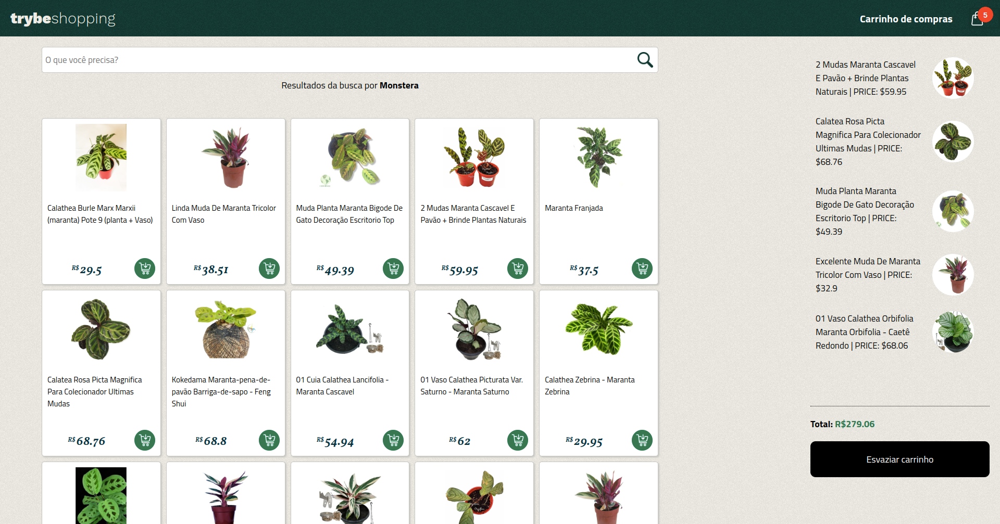

# Shopping Cart

Esta página, desenvolvida em HTML, CSS e JavaScript, simula um comércio eletrônico e consome dados da API do [Mercado Livre](https://www.mercadolivre.com.br/).

[Clique aqui](https://shopping-cart-severidade.vercel.app/) para verificar a versão final do projeto em seu navegador.

OBS: Este projeto foi desenvolvido na [Trybe](https://www.betrybe.com/) dentro do módulo de Fundamentos do Desenvolvimento Web.

## 🤹 Habilidades

  * Conhecimentos em programação assíncrona e manipulação de dados em formato JSON.
  * Uso do local Storage para persistir os dados mesmo após a página ser recarregada ou fechada.
  * Implementação de testes Unitários com Jest

## :hammer_and_wrench: Tools

* HTML5
* CSS3
* JavaScript ES6+
* Jest

## :memo: Metodologias

* Mobile First